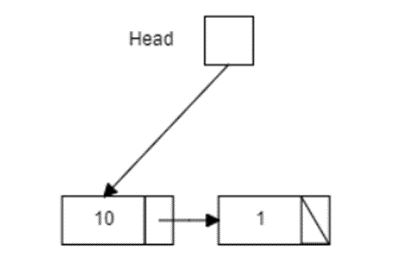
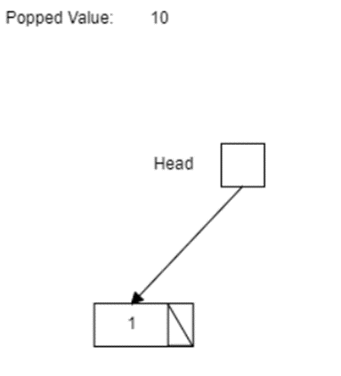
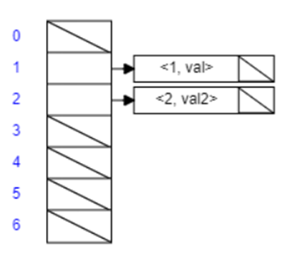
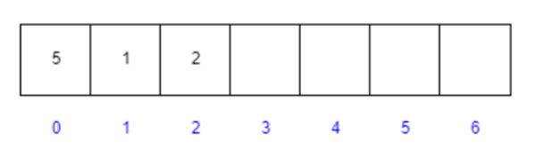
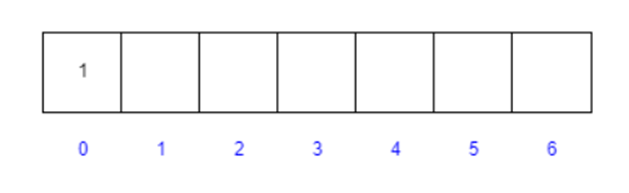
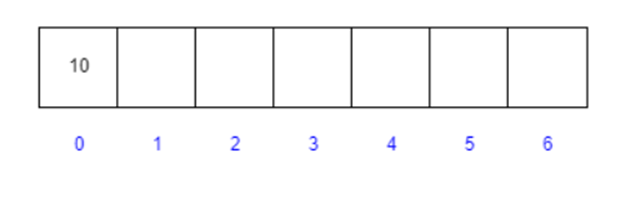

# NoSQL-database

To develop a NoSQL DBMS that meets the following requirements:
1. The database can store data in the following containers:
- Stack
- Queue
- Hash table
- A lot of
- Array
- A single-linked list
- A doubly linked list
- Binary tree

2. The DBMS saves all data to the specified file. 
3. The DBMS has a console interface that meets the following requirement. ./ <your_program_name> --file <the_path_to_the_data_file> -- query <DBMS_request>. 

| Data type | ADD | REMOVE | READ | 
| ------ | ------ | ------ | ------ |
| Stack | SPUSH | SPOP | SPOP |
| Queue | QPUSH | QPOP | QPOP |
| Hash-table | HSET | HDEL | HGET |
| Set | SADD | SREM | SISMEMBER |
| Array | ARADD, ARINS, ARCHG | ARDEL, ARREM | ARGET, ARSRCH | 
| Linked list | LADD, LINS | LDEL_VAL, LDEL, LREM | LGET, LISMEMBER | 
| Doubly linked list | DLADD, DLADDR, DLINS | DLDEL_VAL, DLREM, DLREMR, DLDEL | DLGET, DLISMEMBER |
| Binary tree | TADD | TDEL | TSRCH |

4. It is required to implement a network interface for the DBMS. When launching the application, the DBMS should expect a tcp connection on port 6379. When connecting, it is required to process the request either in a separate thread, or in a separate process, or as an asynchronous task and return the result in response to the request. It is also necessary to take care of locks on the database structure if threads or processes are used.

## Contents

1. [Stack](#stack)
2. [Queue](#queue)
3. [Hash table](#hash-table)
4. [Set](#set)
5. [Array](#array)
6. [Linked list](#linked-list)
7. [Doubly linked list](#doubly-linked-list)
8. [Binary tree](#binary-tree)
9. [Server](#server)
10. [Client](#client)

## Stack

`PUSH` - adding an element to the top of the stack. It takes a pointer to the stack and a pointer to the element to be added to the stack. The complexity of this function is O(1), since all operations are performed in constant time.

`SPOP` - removing an element from the top of the stack and returning it. It also accepts a pointer to the stack. The complexity of this function is also O(1), since all operations are performed in constant time.

An example of how the program works:
>./dbms --file file.data --query 'SPUSH struct val'
>
>REQUEST: val

>./dbms --file file.data --query 'SPUSH struct val10'
>
>REQUEST: val10

\> stack: struct val10 val

>./dbms --file file.data --query 'SPOP struct'
>
>REQUEST: val10

\> stack: struct val

## Queue

`QPUSH` – adds an item to the end of the queue. It allocates memory for a new queue node, sets the value of an element to that node, and changes the pointers to the head and tail of the queue, respectively. It also increases the queue size by 1. The complexity of this function is also O(1), since all operations are performed in constant time.

`QPOP` - removes and returns an item from the beginning of the queue. If the queue is empty, it returns NULL. Otherwise, it saves the value of the element from the head of the queue, changes the pointer to the head of the queue to the next element and reduces the queue size by 1. Then it returns the stored value of the element. The complexity of this function is also O(1), since all operations are performed in constant time.

An example of how the program works:
>./dbms --file file.data --query 'QPUSH struct val'
>
>REQUEST: val

>./dbms --file file.data --query 'QPUSH struct val10'
>
>REQUEST: val10

\> queue: struct val val10

>./dbms --file file.data --query 'QPOP struct'
>
>REQUEST: val

\> queue: struct val10

## Hash table

`hash_calc` – accepts a pointer to a string as input and returns the hash code of this string. It calculates the hash code by summing the ASCII values of the string characters and returns the remainder of the division by the constant MAX_LEN. 

`HSET` – adds a key-value pair to the hash table. It calculates the index in the table using the hash_calc function, then goes through the linked list of elements in this table cell to check if there is already an element with the same key. If an element is found, its value is updated. If the item is not found, a new list node is created and added to the beginning of the list in this table cell. The complexity of this function depends on the number of list items in a given cell and is O(1) on average if the hash function distributes the keys evenly.

`HDEL` – removes the key-value pair from the hash table. It calculates the index in the table using the hash_calc function, then goes through the linked list of elements in this table cell to find the node with the specified key. If a node is found, its value is saved and the node is removed from the list. If the node is not found, NULL is returned. The complexity of this function depends on the number of list items in a given cell and is O(1) on average if the hash function distributes the keys evenly.

`HGET` – returns the value associated with the specified key in the hash table. It calculates the index in the table using the hash_calc function, then goes through the linked list of elements in this table cell to find the node with the specified key. If the node is found, its value is returned. If the node is not found, NULL is returned. The complexity of this function depends on the number of list items in a given cell and is O(1) on average if the hash function distributes the keys evenly.

An example of how the program works:
>./dbms --file file.data --query 'HSET struct 1 val'
>
>REQUEST: val

>./dbms --file file.data --query 'HSET struct 2 val2'
>
>REQUEST: val2

\> hash: struct 1,val 2,val2

> ./dbms --file file.data --query 'HDEL struct 2'
>
>REQUEST: val2

\> hash: struct 1,val

>./dbms --file file.data --query 'HGET struct 1'
>
>REQUEST: val

## Set

`set_calc` – accepts the key as a string and calculates the hash code for this key. It goes through each character in the key string and summarizes their ASCII codes. The summation result is taken modulo MAX_LEN (the maximum number of elements in the set) and returned as a hash code.

`SADD` – adds an element to the set. It calculates the index of the element using set_calc, then checks if this index is occupied. If the index is already occupied, the function returns an error. Otherwise, it creates a new Node_set structure, assigns the passed element to it and adds it to the top of the list with the index index in the set set. At the end, the function returns the added element.

`SREM` – removes an element from the set. It calculates the index of the element using set_calc, then goes through the list of elements with this index and looks for the element to delete. If an item is found, it is deleted from the list, memory is freed, and the deleted item is returned. If the element is not found, the function returns NULL.

`SISMEMBER` – checks whether an element is present in the set. It calculates the index of an element using set_calc, then goes through the list of elements with this index and compares each element with the passed element. If the element is found, the function returns 1, otherwise it returns 0.
To achieve O(1) complexity, it is necessary to use a hash table to store the elements of the set.

An example of how the program works:
>./dbms --file file.data --query 'SADD struct val'
>
>REQUEST: val

>./dbms --file file.data --query 'SADD struct val2'
>
>REQUEST: val2

\> set: struct val val2

>./dbms --file file.data --query 'SREM struct val2'
>
>REQUEST: val2

\> set: struct val

>./dbms --file file.data --query 'SISMEMBER struct val2'
>
>REQUEST: FALSE

## Array

`createArray` - creates an array and allocates memory for its elements. The complexity of this function is O(1), since we only need to allocate memory for the array once.

`ARADD` - adds an element to the end of the array. This function has a complexity of O(1), since adding an element to the end of the array does not depend on the size of the array.

`ARINS` - inserts an element at a specified position in the array. This function has a complexity of O(n), where n is the size of the array, since when an element is inserted into a given position, all elements after this position will shift one position to the right.

`ARDEL` - Deletes the last element of the array. This function has a complexity of O(1), since deleting the last element does not depend on the size of the array.

`ARREM` - Deletes an element at a specified position in the array. This function has a complexity of O(n), where n is the size of the array, since when an element is removed from a given position, all elements after this position will shift one position to the left.

`ARGET` - Returns the value of the element at the specified index. This function has a complexity of O(1), since access to the array element by index is performed directly.

`ARCHG` - Changes the value of an element by the specified index. This function has a complexity of O(1), since access to the array element by index is performed directly.

`ARSRCH` - Searches for an element in the array and returns its index. This function has a complexity of O(n), where n is the size of the array, since in the worst case you will have to check all the elements of the array.

An example of how the program works:
>./dbms --file file.data --query 'ARADD struct 1'
>
>REQUEST: 1

>./dbms --file file.data --query 'ARINS struct 1 2'
>
>REQUEST: 2

>./dbms --file file.data --query 'ARINS struct 0 5'
>
>REQUEST: 5

\> arr: struct 5 1 2

>./dbms --file file.data --query 'ARDEL struct'
>
>REQUEST: 2

\> arr: struct 5 1

>./dbms --file file.data --query 'ARREM struct 0'
>
>REQUEST: 5

\> arr: struct 1

>./dbms --file file.data --query 'ARGET struct 0'
>
>REQUEST: 1

>./dbms --file file.data --query 'ARSRCH struct 1'
>
>REQUEST: 0

>./dbms --file file.data --query 'ARCHG struct 0 10'
>
>REQUEST: 10

\> arr: struct 10

## Linked list

`createList` - creates and initializes a new list structure. It allocates memory for a new list node, assigns the transferred data to it, and sets the pointer to the next element to NULL. The complexity of this function is O(1), since operations on pointers take a constant amount of time and do not depend on the size of the list.

`LADD` - adds a new item to the top of the list. It creates a new node using the createList function and, if the list is empty, assigns the head of the list to a pointer to the new node. If the list is not empty, it sets the pointer to the next element of the new node to the current head of the list, and then assigns the head of the list to the pointer to the new node. The complexity of this function is also O(1), since operations on pointers are performed quickly regardless of the size of the list.

`LINS` - adds an item to the list at the specified index. It creates a new node, and then searches for the insertion position by going through the list items. If the index is found, it places the pointer to the next element of the new node on the current list item, and the pointer to the next element of the previous node on the new node. The complexity of this function is O(n), where n is the size of the list, since it iterates through all the elements to a given index.

`LDEL_VAL` - removes an item from the list by the specified value. It searches for the element corresponding to the specified value and removes it from the list. The complexity of this function is also O(n), since it iterates through all the elements of the list until an element with a given value is found.

`LDEL` - removes an item from the top of the list. It saves the value of the list head, then updates the list head to the next list item. The complexity of this function is O(1), since the only operation performed on pointers - updating the head of the list - takes a constant amount of time and does not depend on the size of the list.

`LREM` - removes an item from the list at the specified index. It searches for an item with the specified index and removes it from the list. The complexity of this function is also O(n), since it iterates through all the elements of the list until the element with the specified index is found.

`LGET` - searches for an item in the list. It iterates through all the items in the list until it finds an item with the specified value or reaches the end of the list. The complexity of this function is also O(n), since it iterates over all elements of the list in the worst case.

An example of how the program works:
>./dbms --file file.data --query 'LADD struct 3'
>
>REQUEST: 3

>./dbms --file file.data --query 'LINS struct 1 0'
>
>REQUEST: 1

>./dbms --file file.data --query 'LINS struct 2 0'
>
>REQUEST: 2

\> list: struct 2 1 3

>./dbms --file file.data --query 'LDEL_VAL struct 3'
>
>REQUEST: 3

>./dbms --file file.data --query 'LREM struct 0'
>
>REQUEST: 2

\> list: struct 1

>./dbms --file file.data --query 'LGET struct 1'
>
>REQUEST: 0

>./dbms --file file.data --query 'LISMEMBER struct 1'
>
>REQUEST: TRUE

## Doubly linked list

`createDList` - creates and initializes a new data structure for a doubly linked list. It allocates memory for the DList structure, sets the head and tail pointers to NULL, and returns the created list. The complexity of this function is O(1), since memory allocation and pointer installation are performed in constant time.

`createNode` - creates and initializes a new list node. It allocates memory for the Node_Dlist structure, sets the pointer to the previous and next nodes to NULL, sets the transmitted data in the element field and returns the created node. The complexity of this function is also O(1), since memory allocation and pointer installation are performed in constant time.

`DLADD` - adds an item to the top of the list. It creates a new node with the transferred data and, if the list is empty, sets head and tail to the new node. Otherwise, it sets the next pointer of the new node to the current head, the prev pointer of the current head to the new node, and updates the head to the new node. The complexity of this function is also O(1), since all operations are performed in constant time.

`DLADDR` - adds an item to the end of the list. It creates a new node with the transferred data and, if the list is empty, sets head and tail to the new node. Otherwise, it sets the next pointer of the current tail to the new node, the prev pointer of the new node to the current tail, and updates the tail to the new node. The complexity of this function is also O(1), since all operations are performed in constant time.

`DLDEL_VAL`- removes a value from the list and returns an updated list. It uses the DLGET() function to find the index of a value in the list and the DLREM() function to remove an item from the list by index. Then it updates the head pointer to the result of deleting the element and returns an updated list. The complexity of this function is also O(1), since all operations are performed in constant time.

`DLINS` - adds an element to the specified index in the list. It creates a new node with the transferred data and, if the list is empty and the index is zero, sets head and tail to the new node. Otherwise, it executes the following algorithm:
1. Finds the node with the specified index in the list.
2. If the node with the specified index is not found, sets the passed element value to "n/a".
3. Otherwise, sets the next pointer of the new node to the current node with the found index, the prev pointer of the new node to the previous node of the found node (if any) or to NULL (if not), updates the prev pointer of the next node after the found index to the new node and updates the next pointer of the previous node before the found index to the new node. If the previous node is missing, updates the head to the new node, otherwise updates the tail to the new node.
4. Sets the passed data to the element variable.
5. Returns the updated list.
The complexity of this function is also O(1), since all operations are performed in constant time, with the exception of the while loop, which iterates through nodes to the specified index, but it is assumed that the number of nodes is limited and does not depend on the size of the list.

`DLREMR` - removes a node from the end of a doubly linked list. If the list is empty, it returns NULL and copies the string "n/a" to the element variable. Otherwise, it copies the value of the element of the last node to the element, frees up the memory associated with the last node and changes the pointers to update the list. The complexity of the DLREMR function is O(1), since the operations of copying and changing pointers are performed in constant time.

`DLDEL` - removes a node from the beginning of a doubly linked list. If the list is empty, it returns NULL and copies the string "n/a" to the element variable. Otherwise, it copies the value of the element of the first node to the element, frees up the memory associated with the first node and changes the pointers to update the list. The complexity of the DLDEL function is O(1), since the operations of copying and changing pointers are performed in constant time.

`DLREM` - removes a node from a doubly linked list at the specified index. If the list is empty, it copies the string "n/a" to the element variable. Otherwise, it finds the node with the specified index and copies the value of its element to element, changes the pointers to update the list and frees up the memory associated with the deleted node. The complexity of the DLREM function is O(n), where n is the number of nodes in the list. In the worst case, the function must pass through all nodes before reaching the node with the specified index.

`DLGET' - searches for a node with a given element value in a doubly linked list. If an element is found, the function returns the index of that node. Otherwise, it returns -1. The complexity of the DLGET function is O(n), where n is the number of nodes in the list. In the worst case, the function must go through all the nodes to find a given element.

An example of how the program works:
>./dbms --file file.data --query 'DLADD struct 1'
>
>REQUEST: 1

>./dbms --file file.data --query 'DLINS struct 2 0'
>
>REQUEST: 2

>./dbms --file file.data --query 'DLADDR struct 3'
>
>REQUEST: 3

\> Dlist: struct 2 1 3

>./dbms --file file.data --query 'DLREM struct 0'
>
>REQUEST: 2

>./dbms --file file.data --query 'DLDEL struct'
>
>REQUEST: 1

>./dbms --file file.data --query 'DLISMEMBER struct 3'
>
>REQUEST: TRUE

>./dbms --file file.data --query 'DLDEL_VAL struct 3'
>
>REQUEST: 3

>./dbms --file file.data --query 'DLGET struct 3'
>
>REQUEST: -1

## Binary tree

`createTree` - creates a new tree node with the specified key. It allocates memory for the new node, sets the key value, the parent node, the left and right child nodes, and returns the new node. The complexity of this function is relatively O(1), since regardless of the size of the tree, it performs a fixed number of operations.

`TADD` - inserts a new node with the specified key into the tree. If the tree is empty, it calls the createTree function to create a root node and returns it. Otherwise, it goes through the tree to find a suitable position to insert a new node. Then it creates a new node, sets its key, parent node, left and right child nodes, and returns the root of the tree. The complexity of this function is relative to O(log n), where n is the number of nodes in the tree. In the worst case, when the tree is balanced, you need to go through the height of the tree to insert a new node.

`TSRCH` - searches for a node with the specified key in the tree. If the tree is empty or the key of the current node is equal to the specified key, it returns the current node. Otherwise, it recursively calls itself for the left or right child node depending on the value of the key. Returns the found node or NULL if the node is not found. The complexity of this function is relative to O(log n), where n is the number of nodes in the tree. In the worst case, when the tree is balanced, you need to go through the height of the tree to find a node.

`succ` - returns the successor of the specified node in the tree. If the right child node has a subtree, it calls the min function to find the minimum value in this subtree and returns it. Otherwise, she goes up the tree to find a successor. Returns the found successor, or NULL if no successor is found. The complexity of this function is relative to O(log n), where n is the number of nodes in the tree. In the worst case, when the tree is balanced, it is required to go through the height of the tree to find a successor.

`min` - returns the node with the minimum value in the tree. It goes down the left subtree to find the minimum value. Returns the found node.

`TDEL` - removes the node with the specified key from the binary search tree. It calls the TSRCH function to search for a node with a given key. If a node is found, it checks its presence of child nodes to determine the type of deletion: if the node is a leaf, it is simply deleted, if the node has only a left or only a right child node, it is replaced by its child, if the node has both child nodes, it is replaced by a successor. Returns the root of the tree.

The `printTree` function is used to print the contents of a binary tree in a structured form. It takes a pointer to the root of the tree and the variable "space", which is used to indent when printing the tree. The complexity of this function with respect to O is O(n), where n is the number of nodes in the binary tree. Since the function must traverse all nodes of the tree, its complexity depends linearly on the size of the tree.

An example of how the program works:
>./dbms --file file.data --query 'TADD struct 1'
>
>REQUEST: 1

>./dbms --file file.data --query 'TADD struct 2'
>
>REQUEST: 2

>./dbms --file file.data --query 'TADD struct 3'
>
>REQUEST: 3

\> tree: struct 1 2 3

>./dbms --file file.data --query 'TSRCH struct 3'
>
>REQUEST: TRUE

>./dbms --file file.data --query 'TDEL struct 2'
>
>REQUEST: 2

## Server

`main` performs the following actions:
- Creating a sockaddr_in structure for the server and client addresses.
- Create a socket using the socket() function. If the socket creation failed, an error message is displayed and the program shuts down.
- Setting the server address parameters, including the protocol family (AF_INET), IP address (INADDR_ANY) and port (PORT).
- Binding a socket to the server address using the bind() function. If the binding fails, an error message is displayed and the program shuts down.
- Waiting for connections using the listen() function. If the wait fails, an error message is displayed and the program shuts down.
- Displays a message about starting the server and waiting for connections.

In the loop:
- Getting a new client socket using the accept() function. If the socket was not received, an error message is displayed and the program shuts down.
- Displays a message about accepting a new connection.
- Processing the client's request in a separate thread using the handle_client() function. 

`handle_client` - accepts the client_socket argument, which is the file descriptor of the socket used to communicate with the client. A mutex mutex is created and initialized inside the function. Next, memory is allocated for the db_file and query lines, after which data is read from the client_socket and written to the corresponding lines. Then a pointer to the req string is created, memory is allocated for the array of parsed_query strings and the query is split into separate words (separated by spaces), each of which is saved to its own string in the parsed_query array. 

'request` - accepts three arguments: a pointer to the db_file string, a double pointer to the query string, and a pointer to the req string. This function is used to process the client's request. The result of the function execution is recorded in req.

`send` - the result is sent to the client, after which the allocated memory for the db_file, query and req lines is freed. The mutex is destroyed, the client socket is closed and a message is displayed about the completion of the connection.

## Client

`main` performs the following actions:

- Checks whether command line arguments (input parameters) are passed when the program is started.
- Creates two variables with pointers to a character array (string) db_file and query.
- In the loop, it goes through each command line argument (starting from index 1) and checks whether the current argument corresponds to one of the two flags "--file" or "--query". If so, reads the next argument into the db_file or query variable, respectively. After that, it increases the value of the counter_of_flags counter.

If the number of flags read is equal to TASK_FLAGS (some constant) and the number of command line arguments exceeds TASK_FLAGS, the program performs the following actions:
- Creating a socket using the socket() function. The function takes the domain (protocol family) as the first parameter, in this case AF_INET - the IPv4 protocol is used, the second parameter is the socket type (SOCK_STREAM - a connection-oriented streaming socket that provides reliable data transmission), and the third parameter is the protocol (0 - the protocol is selected automatically).
  - Setting the server address using the sockaddr_in structure. The AF_INET protocol family is installed, which uses the IP address 127.0.0.1 (localhost) and the PORT (also a constant).
  - Establish a connection to the server using the connect() function. The created socket, a pointer to the structure of the server address and its size are passed as parameters.
  - Sending a request to the server using the send() function. The first parameter specifies the socket, the second parameter specifies the data (db_file string), the third parameter specifies the size of the data, and the fourth parameter specifies the flags. Then a second request is sent using the send() function and passing the query string.
  - Displays a message about the successful sending of the request.
  - Creating a response buffer in which the server's response will be recorded.
  - Receiving the server response using the recv() function. The socket, response buffer, buffer size, and flags are passed as parameters.
  - Output of the received response.
  - Closing the socket using the close() function.

>
>fratellou, 2023