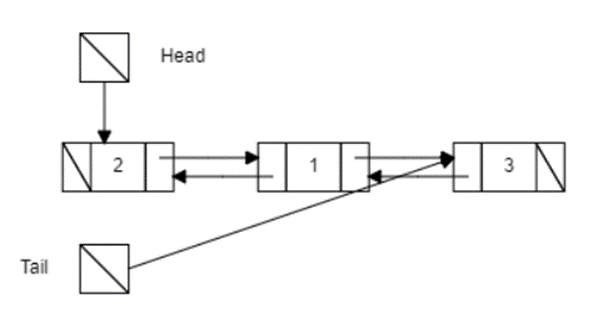

# NoSQL-database

Разработать no-SQL СУБД, отвечающую следующим требованиям: 
1.	База данных умеет хранить данные в следующих контейнерах: 
- Стэк 
- Очередь 
- Хэш-таблица
- Множество 
- Массив
- Односвязный список
- Двусвязный список
- Бинарное дерево

2.	Все данные СУБД сохраняет в указанный файл. 
3.	СУБД имеет консольный интерфейс удовлетворяющий следующему требованию. ./ <имя вашей программы> --file <путь до файла с данными> -- query <запрос к СУБД>. 

| Тип | Добавление | Удаление | Чтение | 
| ------ | ------ | ------ | ------ |
| Стек | SPUSH | SPOP | SPOP |
| Очередь | QPUSH | QPOP | QPOP |
| Хеш-таблица | HSET | HDEL | HGET |
| Множество | SADD | SREM | SISMEMBER |
| Массив | ARADD, ARINS, ARCHG | ARDEL, ARREM | ARGET, ARSRCH | 
| Односвязный список | LADD, LINS | LDEL_VAL, LDEL, LREM | LGET, LISMEMBER | 
| Двусвязный список | DLADD, DLADDR, DLINS | DLDEL_VAL, DLREM, DLREMR, DLDEL | DLGET, DLISMEMBER |
| Бинарное дерево | TADD | TDEL | TSRCH |

4. Требуется реализовать сетевой интерфейс для СУБД. При запуске приложения СУБД должна ожидать соединение по протоколу tcp на порту 6379. При подключении требуется обработать запрос либо в отдельном потоке, либо в отдельном процессе, либо асинхронной задачей и отдать результат в ответ на запрос. Также необходимо позаботится о блокировках на структуре БД если используются потоки или процессы.

## Оглавление

1. [Стек](#Стек)
2. [Очередь](#Очередь)
3. [Хеш-таблица](#Хеш-таблица)
4. [Множество](#Множество)
5. [Массив](#Массив)
6. [Односвязный список](#Односвязный-список)
7. [Двусвязный список](#Двусвязный-список)
8. [Бинарное дерево](#Бинарное-дерево)
9. [Сервер](#Сервер)
10. [Клиент](#Клиент)

## Стек

`SPUSH` - добавление элемента в вершину стека. Она принимает указатель на стек и указатель на элемент, который нужно добавить в стек. Сложность данной функции - O(1), так как все операции выполняются за постоянное время.

`SPOP` - удаление элемента из вершины стека и его возврата. Она также принимает указатель на стек. Сложность данной функции также равна O(1), так как все операции выполняются за постоянное время.

Пример работы программы:
>./dbms --file file.data --query 'SPUSH struct val'
>REQUEST: val
>./dbms --file file.data --query 'SPUSH struct val10'
>REQUEST: val10

Результат:
stack: struct val10 val

>./dbms --file file.data --query 'SPOP struct'
>REQUEST: val10

Результат:
stack: struct val

## Очередь

`QPUSH` – добавляет элемент в конец очереди. Она выделяет память для нового узла очереди, устанавливает значение элемента в этот узел и изменяет указатели на голову и хвост очереди соответственно. Также она увеличивает размер очереди на 1. Сложность данной функции также равна O(1), так как все операции выполняются за постоянное время.

`QPOP` - удаляет и возвращает элемент из начала очереди. Если очередь пуста, то она возвращает NULL. В противном случае, она сохраняет значение элемента из головы очереди, изменяет указатель на голову очереди на следующий элемент и уменьшает размер очереди на 1. Затем она возвращает сохраненное значение элемента. Сложность данной функции также равна O(1), так как все операции выполняются за постоянное время.

Пример работы программы:
>./dbms --file file.data --query 'QPUSH struct val'
>REQUEST: val
>./dbms --file file.data --query 'QPUSH struct val10'
>REQUEST: val10

Результат:
queue: struct val val10

>./dbms --file file.data --query 'QPOP struct'
>REQUEST val

Результат:
queue: struct val10

## Хеш-таблица
hash_calc – принимает на вход указатель на строку и возвращает хэш-код этой строки. Она вычисляет хэш-код суммированием ASCII-значений символов строки и возвращает остаток от деления на константу MAX_LEN. 
HSET – добавляет пару ключ-значение в хэш-таблицу. Она вычисляет индекс в таблице с помощью функции hash_calc, затем проходит по связному списку элементов в этой ячейке таблицы, чтобы проверить, есть ли уже элемент с таким же ключом. Если элемент найден, то его значение обновляется. Если элемент не найден, то создается новый узел списка и добавляется в начало списка в данной ячейке таблицы. Сложность данной функции зависит от количества элементов списка в данной ячейке и составляет O(1) в среднем случае, если хэш-функция равномерно распределяет ключи.
HDEL – удаляет пару ключ-значение из хэш-таблицы. Она вычисляет индекс в таблице с помощью функции hash_calc, затем проходит по связному списку элементов в этой ячейке таблицы, чтобы найти узел с указанным ключом. Если узел найден, то его значение сохраняется, а узел удаляется из списка. Если узел не найден, то возвращается NULL. Сложность данной функции зависит от количества элементов списка в данной ячейке и составляет O(1) в среднем случае, если хэш-функция равномерно распределяет ключи.
HGET – возвращает значение, связанное с указанным ключом в хэш-таблице. Она вычисляет индекс в таблице с помощью функции hash_calc, затем проходит по связному списку элементов в этой ячейке таблицы, чтобы найти узел с указанным ключом. Если узел найден, то возвращается его значение. Если узел не найден, то возвращается NULL. Сложность данной функции зависит от количества элементов списка в данной ячейке и составляет O(1) в среднем случае, если хэш-функция равномерно распределяет ключи.

Пример работы программы:
./dbms --file file.data --query 'HSET struct 1 val'
REQUEST: val
./dbms --file file.data --query 'HSET struct 2 val2'
REQUEST: val2

Результат: hash: struct 1,val 2,val2

./dbms --file file.data --query 'HDEL struct 2'
Результат: hash: struct 1,val
REQUEST: val2

./dbms --file file.data --query 'HGET struct 1'
Результат:
REQUEST: val

## Множество
set_calc – принимает ключ в виде строки и вычисляет хеш-код для данного ключа. Она проходит по каждому символу в строке ключа и суммирует их ASCII-коды. Результат суммирования берется по модулю от MAX_LEN (максимального количества элементов во множестве) и возвращается как хеш-код.
SADD – добавляет элемент в множество. Она вычисляет индекс элемента с помощью set_calc, затем проверяет, не является ли данный индекс занятым. Если индекс уже занят, то функция возвращает ошибку. В противном случае, она создает новую структуру Node_set, присваивает ей переданный элемент и добавляет ее в начало списка с индексом index в множестве set. В конце функция возвращает добавленный элемент.
SREM – удаляет элемент из множества. Она вычисляет индекс элемента с помощью set_calc, затем проходит по списку элементов с данным индексом и ищет элемент для удаления. Если элемент найден, то он удаляется из списка, освобождается память и возвращается удаленный элемент. Если элемент не найден, то функция возвращает NULL.
SISMEMBER – проверяет, присутствует ли элемент в множестве. Она вычисляет индекс элемента с помощью set_calc, затем проходит по списку элементов с данным индексом и сравнивает каждый элемент с переданным элементом. Если элемент найден, то функция возвращает 1, в противном случае - 0.
Для достижения сложности O(1) необходимо использовать хеш-таблицу для хранения элементов множества.

Пример работы программы:
./dbms --file file.data --query 'SADD struct val'
./dbms --file file.data --query 'SADD struct val2'
Результат:
set: struct val val2

./dbms --file file.data --query 'SREM struct val2'
Результат: set: struct val

./dbms --file file.data --query 'SISMEMBER struct val2'
Результат:
-> FALSE

## Массив
createArray - создает массив и выделяет память для его элементов. Сложность данной функции составляет O(1), так как нам необходимо только однократно выделить память для массива.
ARADD - добавляет элемент в конец массива. Данная функция имеет сложность O(1), поскольку добавление элемента в конец массива не зависит от размера массива.
ARINS - вставляет элемент в заданную позицию в массиве. Данная функция имеет сложность O(n), где n - размер массива, так как при вставке элемента в заданную позицию, все элементы после этой позиции будут сдвигаться на одну позицию вправо.
ARDEL - Удаляет последний элемент массива. Данная функция имеет сложность O(1), так как удаление последнего элемента не зависит от размера массива.
ARREM - Удаляет элемент в заданной позиции в массиве. Данная функция имеет сложность O(n), где n - размер массива, так как при удалении элемента из заданной позиции, все элементы после этой позиции будут сдвигаться на одну позицию влево.
ARGET - Возвращает значение элемента по заданному индексу. Данная функция имеет сложность O(1), так как доступ к элементу массива по индексу осуществляется непосредственно.
ARCHG - Изменяет значение элемента по заданному индексу. Данная функция имеет сложность O(1), так как доступ к элементу массива по индексу осуществляется непосредственно.
ARSRCH - Поиск элемента в массиве и возвращает его индекс. Данная функция имеет сложность O(n), где n - размер массива, так как в худшем случае придется проверить все элементы массива.

Пример работы программы:
./dbms --file file.data --query 'ARADD struct 1'
REQUEST: 1
./dbms --file file.data --query 'ARINS struct 1 2'
REQUEST: 2
./dbms --file file.data --query 'ARINS struct 0 5'
REQUEST: 5
Результат: arr: struct 5 1 2

./dbms --file file.data --query 'ARDEL struct'
Результат: arr: struct 5 1
REQUEST: 2

./dbms --file file.data --query 'ARREM struct 0'
Результат: arr: struct 1
REQUEST: 5

./dbms --file file.data --query 'ARGET struct 0'
REQUEST: 1

./dbms --file file.data --query 'ARSRCH struct 1'
REQUEST: 0

./dbms --file file.data --query 'ARCHG struct 0 10'
REQUEST: 10
Результат: arr: struct 10

## Односвязный список
Функция createList создает и инициализирует новую структуру списка. Она выделяет память под новый узел списка, присваивает ему переданные данные и устанавливает указатель на следующий элемент в NULL. Сложность этой функции O(1), так как операции над указателями занимают постоянное количество времени и не зависят от размера списка.
Функция LADD добавляет новый элемент в начало списка. Она создает новый узел с помощью функции createList и, если список пустой, присваивает голову списка указателю на новый узел. Если список не пустой, она устанавливает указатель на следующий элемент нового узла на текущую голову списка, а затем присваивает голову списка указателю на новый узел. Сложность этой функции также O(1), поскольку операции над указателями выполняются быстро независимо от размера списка.
Функция LINS добавляет элемент в список по заданному индексу. Она создает новый узел, а затем ищет позицию вставки перебирая элементы списка. Если индекс найден, она встанавливает указатель на следующий элемент нового узла на текущий элемент списка, а указатель на следующий элемент предыдущего узла на новый узел. Сложность этой функции O(n), где n - размер списка, так как она выполняет итерацию по всем элементам до заданного индекса.
Функция LDEL_VAL удаляет элемент из списка по заданному значению. Она ищет элемент соответствующий заданному значению и удаляет его из списка. Сложность этой функции также O(n), так как она выполняет итерацию по всем элементам списка до нахождения элемента с заданным значением.
Функция LDEL удаляет элемент из начала списка. Она сохраняет значение головы списка, затем обновляет голову списка на следующий элемент списка. Сложность этой функции O(1), так как единственная операция выполняемая над указателями - обновление головы списка - занимает постоянное количество времени и не зависит от размера списка.
Функция LREM удаляет элемент из списка по заданному индексу. Она ищет элемент с заданным индексом и удаляет его из списка. Сложность этой функции также O(n), так как она выполняет итерацию по всем элементам списка до нахождения элемента с заданным индексом.
Функция LGET ищет элемент в списке. Она выполняет итерацию по всем элементам списка, пока не найдет элемент с заданным значением или не достигнет конца списка. Сложность этой функции также O(n), так как она выполняет итерацию по всем элементам списка в худшем случае.

Пример работы программы:
./dbms --file file.data --query 'LADD struct 3'
REQUEST: 3
./dbms --file file.data --query 'LINS struct 1 0'
REQUEST: 1
./dbms --file file.data --query 'LINS struct 2 0'
REQUEST: 2
Результат: list: struct 2 1 3

./dbms --file file.data --query 'LDEL_VAL struct 3'
REQUEST: 3
./dbms --file file.data --query 'LREM struct 0'
REQUEST: 2
Результат: list: struct 1

./dbms --file file.data --query 'LGET struct 1'
REQUEST: 0

./dbms --file file.data --query 'LISMEMBER struct 1'
REQUEST: TRUE

## Двусвязный список
Функция createDList() создает и инициализирует новую структуру данных двусвязного списка. Она выделяет память под структуру DList, устанавливает указатели head и tail на NULL и возвращает созданный список. Сложность этой функции O(1), так как выделение памяти и установка указателей выполняются за постоянное время.
Функция createNode() создает и инициализирует новый узел списка. Она выделяет память под структуру Node_Dlist, устанавливает указатель на предыдущий и следующий узлы на NULL, устанавливает переданные данные в поле element и возвращает созданный узел. Сложность этой функции также O(1), так как выделение памяти и установка указателей выполняются за постоянное время.
Функция DLADD() добавляет элемент в начало списка. Она создает новый узел с переданными данными и, если список пустой, устанавливает head и tail на новый узел. Иначе, она устанавливает указатель next нового узла на текущий head, указатель prev текущего head на новый узел и обновляет head на новый узел. Сложность этой функции тоже O(1), так как все операции выполняются за постоянное время.
Функция DLADDR() добавляет элемент в конец списка. Она создает новый узел с переданными данными и, если список пустой, устанавливает head и tail на новый узел. Иначе, она устанавливает указатель next текущего tail на новый узел, указатель prev нового узла на текущий tail и обновляет tail на новый узел. Сложность этой функции также O(1), так как все операции выполняются за постоянное время.
Функция DLDEL_VAL() удаляет значение из списка и возвращает обновленный список. Она использует функцию DLGET() для нахождения индекса значения в списке и функцию DLREM() для удаления элемента из списка по индексу. Затем она обновляет указатель head на результат удаления элемента и возвращает обновленный список. Сложность этой функции также O(1), так как все операции выполняются за постоянное время.
Функция DLINS() добавляет элемент по заданному индексу в списке. Она создает новый узел с переданными данными и, если список пустой и индекс равен нулю, устанавливает head и tail на новый узел. Иначе, она выполняет следующий алгоритм:
1. Находит узел с указанным индексом в списке.
2. Если узел с указанным индексом не найден, устанавливает переданное значение element в "n/a".
3. Иначе, устанавливает указатель next нового узла на текущий узел с найденным индексом, указатель prev нового узла на предыдущий узел найденного узла (если есть) или на NULL (если нет), обновляет указатель prev следующего узла после найденного индекса на новый узел и обновляет указатель next предыдущего узла перед найденным индексом на новый узел. Если предыдущий узел отсутствует, обновляет head на новый узел, иначе обновляет tail на новый узел.
4. Устанавливает переданные данные в переменную element.
5. Возвращает обновленный список.
Сложность этой функции также O(1), так как все операции выполняются за постоянное время, за исключением while-цикла, который перебирает узлы до указанного индекса, но предполагается, что количество узлов ограничено и не зависит от размера списка.
Функция DLREMR удаляет узел с конца двусвязного списка. Если список пуст, она возвращает NULL и копирует строку "n/a" в переменную element. Иначе, она копирует значение элемента последнего узла в element, освобождает память, связанную с последним узлом и изменяет указатели, чтобы обновить список. Сложность функции DLREMR составляет O(1), так как операции копирования и изменения указателей выполняются за константное время.
Функция DLDEL удаляет узел из начала двусвязного списка. Если список пуст, она возвращает NULL и копирует строку "n/a" в переменную element. Иначе, она копирует значение элемента первого узла в element, освобождает память, связанную с первым узлом и изменяет указатели, чтобы обновить список. Сложность функции DLDEL составляет O(1), так как операции копирования и изменения указателей выполняются за константное время.
Функция DLREM- удаляет узел из двусвязного списка по заданному индексу. Если список пуст, она копирует строку "n/a" в переменную element. Иначе, она находит узел с заданным индексом и копирует значение его элемента в element, изменяет указатели, чтобы обновить список и освобождает память, связанную с удаленным узлом. Сложность функции DLREM- составляет O(n), где n - количество узлов в списке. В худшем случае функция должна пройти через все узлы до достижения узла с заданным индексом.
Функция DLGET выполняет поиск узла с заданным значением элемента в двусвязном списке. Если элемент найден, функция возвращает индекс этого узла. В противном случае, она возвращает -1. Сложность функции DLGET составляет O(n), где n - количество узлов в списке. В худшем случае функция должна пройти через все узлы для поиска заданного элемента.

Пример работы программы:
./dbms --file file.data --query 'DLADD struct 1'
REQUEST: 1
./dbms --file file.data --query 'DLINS struct 2 0'
REQUEST: 2
./dbms --file file.data --query 'DLADDR struct 3'
REQUEST: 3
Результат: Dlist: struct 2 1 3

./dbms --file file.data --query 'DLREM struct 0'
REQUEST: 2
./dbms --file file.data --query 'DLDEL struct'
REQUEST: 1

./dbms --file file.data --query 'DLISMEMBER struct 3'
REQUEST: TRUE

./dbms --file file.data --query 'DLDEL_VAL struct 3'
REQUEST: 3

./dbms --file file.data --query 'DLGET struct 3'
REQUEST: -1

## Бинарное дерево
createTree - создает новый узел дерева с заданным ключом. Она выделяет память для нового узла, устанавливает значение ключа, родительский узел, левый и правый дочерние узлы, и возвращает новый узел. Сложность этой функции относительно O(1), так как независимо от размера дерева, она выполняет фиксированное количество операций.
TADD - вставляет новый узел с заданным ключом в дерево. Если дерево пустое, она вызывает функцию createTree для создания корневого узла и возвращает его. В противном случае, она проходит по дереву, чтобы найти подходящую позицию для вставки нового узла. Затем она создает новый узел, устанавливает его ключ, родительский узел, левый и правый дочерние узлы, и возвращает корень дерева. Сложность этой функции относительно O(log n), где n - количество узлов в дереве. В худшем случае, когда дерево является сбалансированным, требуется пройти по высоте дерева для вставки нового узла.
TSRCH - ищет узел с заданным ключом в дереве. Если дерево пустое или ключ текущего узла равен заданному ключу, она возвращает текущий узел. В противном случае, она рекурсивно вызывает себя для левого или правого дочернего узла в зависимости от значения ключа. Возвращает найденный узел или NULL, если узел не найден. Сложность этой функции относительно O(log n), где n - количество узлов в дереве. В худшем случае, когда дерево является сбалансированным, требуется пройти по высоте дерева для поиска узла.
succ - возвращает преемника заданного узла в дереве. Если у правого дочернего узла есть поддерево, она вызывает функцию min для нахождения минимального значения в этом поддереве и возвращает его. В противном случае, она проходит вверх по дереву, чтобы найти преемника. Возвращает найденного преемника или NULL, если преемник не найден. Сложность этой функции относительно O(log n), где n - количество узлов в дереве. В худшем случае, когда дерево является сбалансированным, требуется пройти по высоте дерева для поиска преемника.
min - возвращает узел с минимальным значением в дереве. Она проходит вниз по левому поддереву, чтобы найти минимальное значение. Возвращает найденный узел.
TDEL - удаляет узел с заданным ключом из двоичного дерева поиска. Она вызывает функцию TSRCH для поиска узла с заданным ключом. Если узел найден, она проверяет его наличие дочерних узлов для определения типа удаления: если узел является листом, он просто удаляется, если узел имеет только левого или только правого дочернего узла, он замещается на своего ребенка, если узел имеет оба дочерних узла, его заменяет преемник. Возвращает корень дерева.
printTree - функция используется для печати содержимого бинарного дерева в структурированном виде. Она принимает указатель на корень дерева и переменную "space", которая используется для отступа при печати дерева. Сложность этой функции относительно O - это O(n), где n - количество узлов в бинарном дереве. Так как функция должна обойти все узлы дерева, ее сложность линейно зависит от размера дерева.

Пример работы программы:
./dbms --file file.data --query 'TADD struct 1'
REQUEST: 1
./dbms --file file.data --query 'TADD struct 2'
REQUEST: 2
./dbms --file file.data --query 'TADD struct 3'
REQUEST: 3
Результат: tree: struct 1 2 3

./dbms --file file.data --query 'TSRCH struct 3'
REQUEST: TRUE

./dbms --file file.data --query 'TDEL struct 2'
REQUEST: 2

## Сервер
Основная функция main выполняет следующие действия:
-	Создание структуры `sockaddr_in` для адреса сервера и клиента.
-	Создание сокета с помощью функции `socket()`. Если создание сокета не удалось, то выводится сообщение об ошибке и программа завершает работу.
-	Установка параметров адреса сервера, включая семейство протоколов (`AF_INET`), IP-адрес (`INADDR_ANY`) и порт (`PORT`).
-	Привязка сокета к адресу сервера с помощью функции `bind()`. Если привязка не удалась, то выводится сообщение об ошибке и программа завершает работу.
-	Ожидание соединений с помощью функции `listen()`. Если ожидание не удалось, то выводится сообщение об ошибке и программа завершает работу.
-	Вывод сообщения о запуске сервера и ожидании соединений.
В цикле:
-	Получение нового сокета клиента с помощью функции `accept()`. Если получение сокета не удалось, то выводится сообщение об ошибке и программа завершает работу.
-	Вывод сообщения о принятии нового соединения.
-	Обработка запроса клиента в отдельном потоке с помощью функции `handle_client()`. 

Функция `handle_client` принимает аргумент `client_socket`, который является файловым дескриптором сокета, используемого для связи с клиентом. Внутри функции создается и инициализируется мьютекс `mutex`. Далее, выделяется память для строки `db_file` и `query`, после чего считываются данные из `client_socket` и записываются в соответствующие строки. Затем создается указатель на строку `req`, выделяется память для массива строк `parsed_query` и выполняется разбиение `query` на отдельные слова (разделенные пробелами), каждое из которых сохраняется в свою строку в массиве `parsed_query`. 

После этого вызывается функция `request` с аргументами `db_file`, `parsed_query` и `req`. Функция `request` принимает три аргумента: указатель на строку `db_file`, двойной указатель на строку `query` и указатель на строку `req`. Эта функция служит для обработки запроса клиента. Результат выполнения функции записывается в `req`.

Затем результат отправляется клиенту с помощью функции `send`, после чего освобождается выделенная память для строк `db_file`, `query` и `req`. Мьютекс уничтожается, сокет клиента закрывается и выводится сообщение о завершении подключения.

## Клиент
Сначала программа проверяет, переданы ли аргументы командной строки (входные параметры) при запуске программы.
Затем создаёт две переменные с указателями на символьный массив (строку) db_file и query. Для их выделения используется функция malloc, которая выделяет для каждой строки память размером MAX_LEN * sizeof(char), где MAX_LEN - некоторая константа.
В цикле проходит по каждому аргументу командной строки (начиная с индекса 1) и проверяет, соответствует ли текущий аргумент одному из двух флагов "--file" или "--query". Если да, то считывает следующий аргумент в переменную db_file или query соответственно. После этого увеличивает значение счетчика counter_of_flags.
Если количество считанных флагов равно TASK_FLAGS (некоторая константа) и количество аргументов командной строки превышает TASK_FLAGS, то программа выполняет следующие действия:
  - Создание сокета с помощью функции socket(). Функция принимает первым параметром домен (семейство протоколов), в данном случае AF_INET - используется протокол IPv4, вторым параметром тип сокета (SOCK_STREAM - ориентированный на соединения потоковый сокет, обеспечивающий надежную передачу данных), а третьим параметром - протокол (0 - протокол выбирается автоматически).
  - Задание адреса сервера с помощью структуры sockaddr_in. Устанавливается семейство протоколов AF_INET, в котором используется IP-адрес 127.0.0.1 (localhost) и порт PORT (также является константой).
  - Установка соединения с сервером с помощью функции connect(). В качестве параметров передаются созданный сокет, указатель на структуру серверного адреса и его размер.
  - Отправка запроса серверу с помощью функции send(). В первом параметре указывается сокет, во втором - данные (строка db_file), в третьем - размер данных, а в четвертом - флаги. Затем отправляется второй запрос с помощью функции send() и передачей строки query.
  - Вывод сообщения о успешной отправке запроса.
  - Создание буфера response, в который будет записан ответ сервера.
  - Получение ответа сервера с помощью функции recv(). В качестве параметров передаются сокет, буфер response, размер буфера и флаги.
  - Вывод полученного ответа.
  - Закрытие сокета с помощью функции close().
